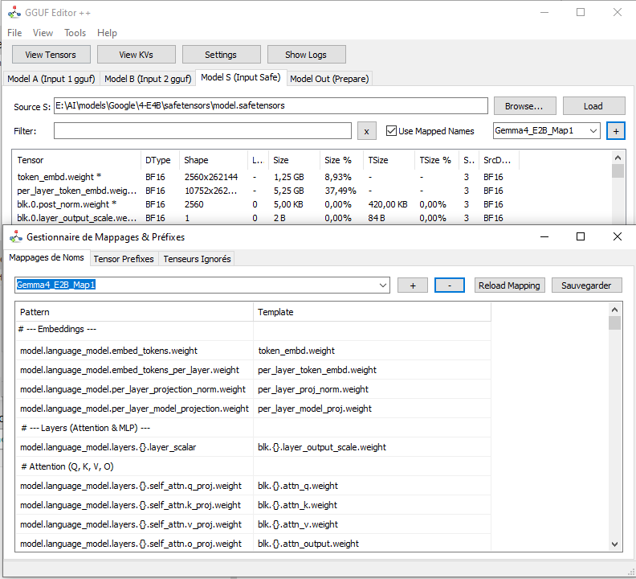

# Detailed Features

## 1. Model Editing and Merging

The tool allows loading up to three model sources simultaneously:

- **Model A (GGUF):** Base model.
- **Model B (GGUF):** Second model for merging.
- **Model S (Safetensors):** Integration of PyTorch weights.

You can transfer specific tensors or by layer (all "blks", or odd/even layers) to the output model.

## 2. Visualization and Analysis

Access the "Tensors" view to inspect the internals of your models.

- **Time Series (Plots):** Visualize float values along a tensor. Detect anomalies and outliers.
- **Comparison (T1 − T2):** Subtract two tensors to see the difference (useful for fusion analysis).
- **Histograms:** Analyze weight distribution (normal, Gaussian, etc.).

## 3. Name Mapping

The mapping engine allows automatic renaming of tensors to adapt a model to a target architecture.

- Support for generic patterns (e.g., `blk.{}.attn.weight`).
- External configuration files (.txt).
- Management of ignored prefixes.

## 4. Intelligent Quantization

Real-time conversion of tensor types:

- **Llama.cpp DLL:** Usage of native libraries for high-fidelity dequantization (minimized RMSE).
- **Impl Mode:** Alternative software algorithm for maximum stability or when the DLL is unavailable.
- **Quantization Simulation:** See what an FP32 tensor would look like converted to Q4_K without writing it.

## 5. Split and Merge

Integrated tools for:

- **Split:** Divide a large GGUF model into multiple files (e.g., 4GB).
- **Merge:** Recombine multiple GGUF shards into a single coherent file.

---

© 2026 GGUF Editor D++ By ABBN.
