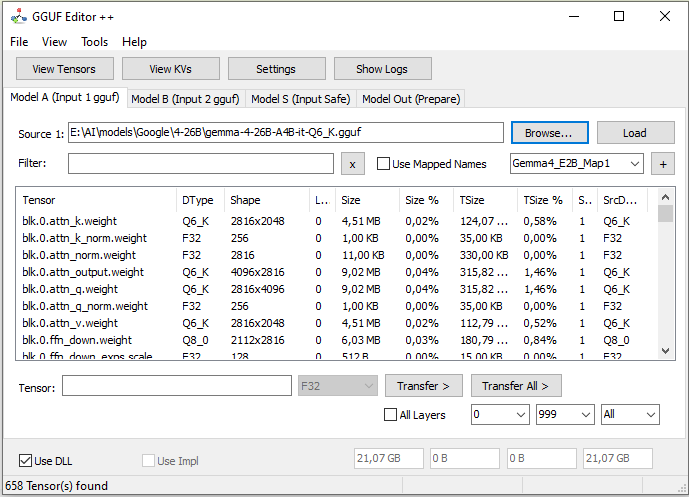

# Welcome to GGUF Editor D++

GGUF Editor D++ is a cutting-edge tool for manipulating, analyzing, and optimizing Language Model (LLM) files in **GGUF** and **Safetensors** formats. Developed in Delphi, it offers a high-performance interface for researchers and developers.

*Main Interface: Tensor visualization and model management.*

## Why use GGUF Editor D++?

- **Multi-Source:** Merge GGUF models with PyTorch Safetensors weights.
- **Real-time Visualization:** Analyze tensor distribution and values with interactive charts.
- **High Performance:** Optimized usage of DLLs (Llama.cpp) for quantization/dequantization.
- **Advanced Editing:** Modify metadata (KVs) and tensor names via mapping.

### Compatibility

The tool supports a wide range of quantization types: `Q4_0`, `Q4_1`, `Q5_0`, `Q5_1`, `Q8_0`, `Q8_1`, `Q2_K`, `Q3_K`, `Q4_K`, `Q5_K`, `Q6_K`, `Q8_K`, `IQ4_NL`, `MXFP4`, `NVFP4`, and more.

---
[ 🏠 Home ](index.md)  [⚙️ Features ](features.md)  [📘 User Guide](usage.md)  [🔧 Technical ](technical.md) [ ❤️ Support ](donate.md) 
---
© 2026 GGUF Editor D++ By ABBN. Technical Documentation.
