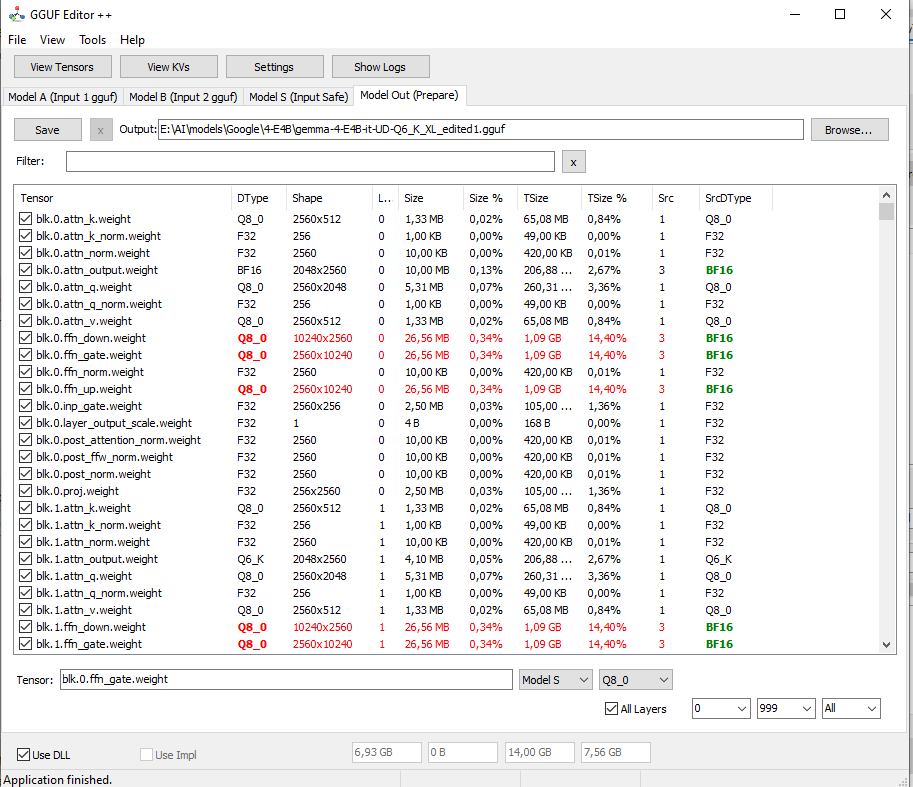
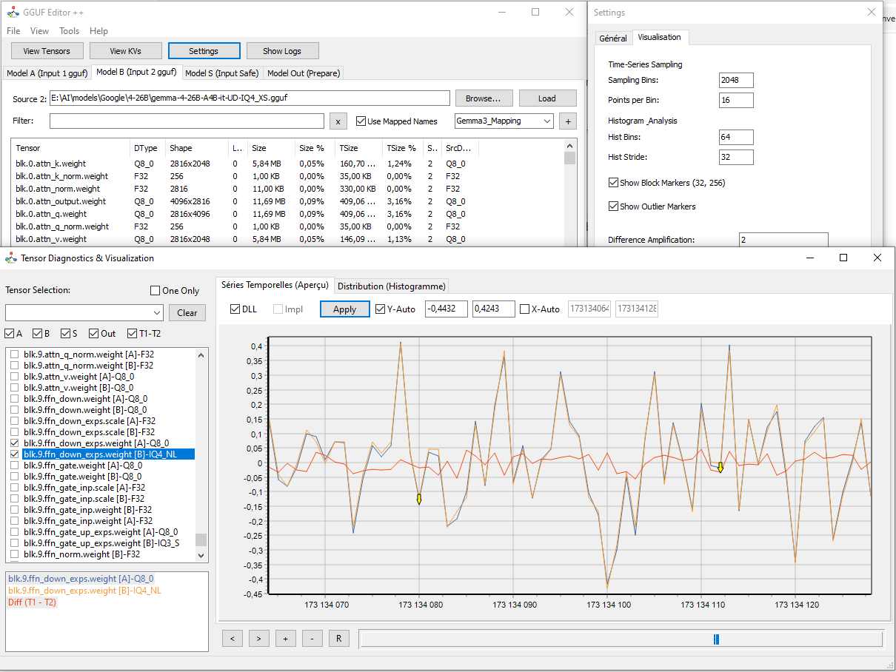

# Quick Usage Guide

## 1. Merge Workflow

This guide explains how to merge a base model (A) with weights (B) to create a new model.

### Steps

1. **Loading**
   - Browse & Load *Model A* (Your base).
   - Browse & Load *Model B* (Your specific weights).

2. **Selection**
   - In the "Model B" tab, check the tensors to transfer or use "Transfer All".
   - Use layer filters (e.g., `16..32` or `Mod 2` for odd layers).

3. **Verification (Optional)**
   - Open "View Tensors".
   - Load A and B. Use the "Diff (T1−T2)" tab to verify value differences.

4. **Output**
   - The "Model Out" tab now contains the merged list.
   - Set the output path in the "Output" field.
   - Click **Save**.

## 2. Using Visualization

*Example visualization with block detection and outliers.*

### Navigation

- **Bottom Slider:** Scrolls the view horizontally.
- **Mouse Wheel:** Zoom in/out.
- **Click & Drag:** Pan the view window.
- **Keyboard:** Use `+`/`-` to zoom, `<`/`>` to scroll.

### Export

You can export the data displayed in the histogram or time series via the context menu or export buttons (CSV/TXT format).

## 3. Configuration

Access *Settings* to:

- Enable/Disable the use of external DLLs (faster).
- Default split size settings.
- Difference amplification (to see minimal deviations).

---

© 2026 GGUF Editor D++ By ABBN.
